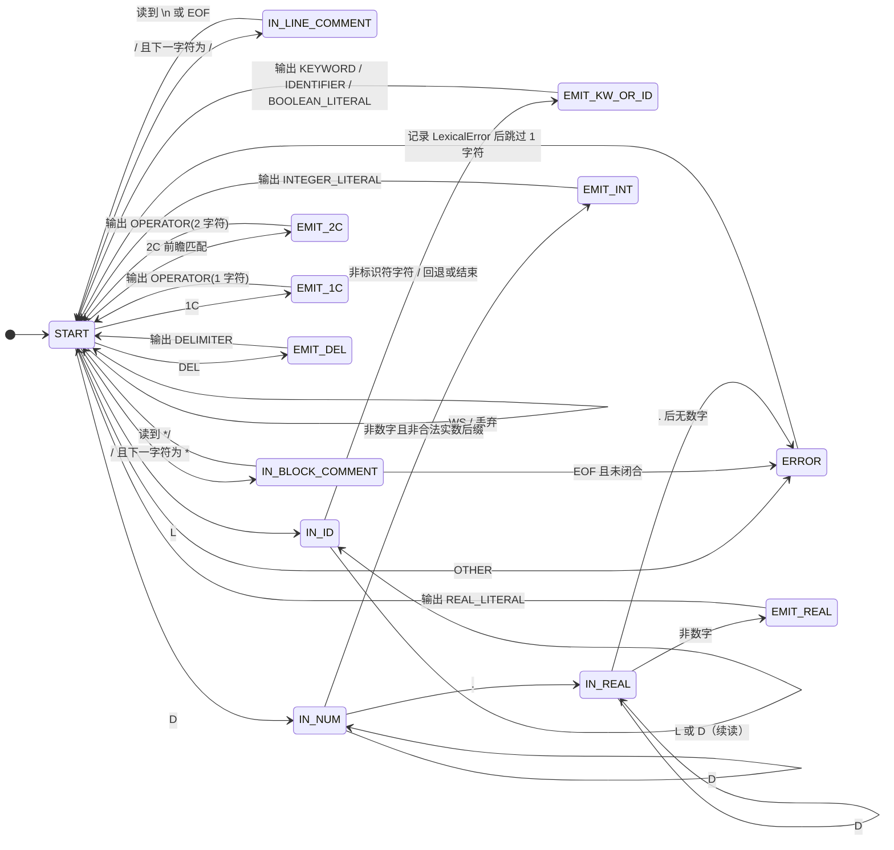

# 编译系统综合实验报告

> 课程：编译原理 · 综合实验  
> 工程路径：`Compiler/`（Java 17 + Maven）  
> 入口：`edu.groupname.compiler.app.CompilerApplication`

---

## 一、功能描述

本编译器按三阶段实现并合并为一条流水线：

1. **词法分析**：识别关键字、标识符、整型/实数/布尔常量、运算符与分隔符；输出 `(单词名称, 单词类别)`；删除注释与空白；建立按首次出现顺序的符号表，并在扫描 `int/float/bool`（及 `type[num]`）声明后为标识符绑定类型；报告词法错误及行列位置。
2. **LR(1) 语法分析**：根据课程文法构造 LR(1) 分析表，对 token 串自下而上分析；输出完整 ACTION/GOTO 表及每一步状态栈、符号栈、剩余输入与动作。
3. **语法制导翻译**：在 LR 规约时生成三地址码（四元式）与语义动作；语义分析阶段完成作用域、重复定义、未定义标识符、break 合法性等检查；输出完整分析过程与四元式。存在语义错误时，**不采用**中间代码作为最终结果，但**仍打印**语法阶段已生成的四元式供对照（见 `ExperimentDemo` 说明行）。

文法与任务书阶段二/三差异见 `docs/文法与任务书对照说明.md`。

---

## 二、程序结构描述

| 模块 | 主要类 | 功能 |
|------|--------|------|
| 入口 | `CompilerApplication` | 读源文件、调用流水线、打印三阶段报告 |
| 流水线 | `CompilerPipeline` | `Lexer → Parser → SemanticAnalyzer → IRGenerator` |
| 词法 | `LexerImpl`, `SourceBuffer`, `LexicalDeclarationBinder` | 扫描、符号表、声明类型绑定 |
| 语法 | `LR1Parser`, `Grammar`, `ParseReporter` | LR(1) 建表与分析、trace |
| 语法制导 | `SemanticReduceHandler`, `SemanticAnalyzerImpl` | 规约时四元式 + 语义动作检查 |
| 中间代码 | `IrBuilder`, `IRGeneratorImpl`, `IrReporter` | 四元式组装与格式化输出 |
| 符号表 | `ScopedSymbolTable`, `Symbol` | 词法/语义两阶段符号管理 |

**调用关系（简图）**：

```text
main → CompilerPipeline.compile
     → LexerImpl.analyze → LexicalDeclarationBinder
     → LR1Parser.parse → SemanticReduceHandler（规约回调）
     → SemanticAnalyzerImpl.analyze
     → IRGeneratorImpl.generate → ExperimentDemo.printReport
```

---

## 三、符号表设计与结构

- **词法阶段**：`ScopedSymbolTable` + `registerIdentifier` 按首次出现登记；`LexicalDeclarationBinder` 根据 `type id;` / `type[num] id;` 将类型更新为 `int`/`float`/`bool`/`int[]` 等。
- **语义阶段**：独立 `ScopedSymbolTable`，通过规约动作 `ENTER_SCOPE`/`EXIT_SCOPE`/`DECLARE`/`USE` 等维护作用域与类型检查。
- **输出格式**：`(名字, 类型, 种类)`，种类为 `VARIABLE` 或 `ARRAY`。

---

## 四、关键算法说明

### 4.1 词法分析：有限状态自动机（DFA）

实验一指导要求「设计有限状态自动机」。本组先给出 DFA 设计，再在 `LexerImpl` 中按等价逻辑实现（**直接编码**，未在程序中维护二维转移表数组，以降低实现复杂度；行为与下述自动机一致）。

#### 4.1.1 输入字符分类

| 类别 | 说明 | 示例 |
|------|------|------|
| `WS` | 空白 | 空格、`\t`、`\n` |
| `L` | 标识符首字符 | 字母、`_` |
| `D` | 数字 | `0`～`9` |
| `.` | 小数点 | `.`（仅当其后仍为数字时组成实数） |
| `/` | 斜杠 | 可能开始注释或运算符 `/` |
| `*` | 星号 | 与 `/` 组合处理块注释 |
| `2C` | 双字符运算符 | `==`、`!=`、`<=`、`>=`、`&&`、`||` |
| `1C` | 单字符运算符 | `+ - * = < > !` |
| `DEL` | 分隔符 | `{ } ( ) [ ] ;` |
| `OTHER` | 其它 | 报错 |

#### 4.1.2 状态图



> 说明：`EMIT_*` 表示**动作状态**（输出 token 后回到 `START` 继续扫描）。`IN_ID` 读完单词后根据表查找区分关键字、`true`/`false`、普通标识符。

#### 4.1.3 状态转移表（摘要）

| 当前状态 | 输入类 | 下一状态 | 动作 |
|----------|--------|----------|------|
| START | WS | START | 更新行/列，不输出 |
| START | `/` + `/` | IN_LINE_COMMENT | 跳过 `//` 至行尾 |
| START | `/` + `*` | IN_BLOCK_COMMENT | 跳过块注释至 `*/` |
| START | `/`（其它） | EMIT_1C | 输出 `/` |
| START | L | IN_ID | 开始记录 lexeme |
| START | D | IN_NUM | 开始记录整数部分 |
| START | 2C | EMIT_2C | 输出双字符运算符 |
| START | 1C | EMIT_1C | 输出单字符运算符 |
| START | DEL | EMIT_DEL | 输出分隔符 |
| START | OTHER | ERROR | 非法字符 |
| IN_ID | L 或 D | IN_ID | 继续读 |
| IN_ID | 其它 | EMIT_KW_OR_ID | 查 `KeywordTable` / `true`/`false` → 输出对应 token |
| IN_NUM | D | IN_NUM | 继续读 |
| IN_NUM | `.` 且后跟 D | IN_REAL | 进入实数 |
| IN_NUM | 其它 | EMIT_INT | 输出 INTEGER_LITERAL |
| IN_REAL | D | IN_REAL | 继续读小数部分 |
| IN_REAL | 其它 | EMIT_REAL | 输出 REAL_LITERAL |
| IN_LINE_COMMENT | `\n` 或 EOF | START | 无输出 |
| IN_BLOCK_COMMENT | `*/` | START | 无输出 |
| IN_BLOCK_COMMENT | EOF | ERROR | 未闭合块注释 |

扫描结束后在 token 序列末尾追加 `<EOF>`。

#### 4.1.4 与程序实现的对应关系

| DFA 设计 | `LexerImpl.java` 中的实现 |
|----------|---------------------------|
| START + WS | `Character.isWhitespace` 分支（约 31～39 行） |
| IN_LINE_COMMENT | `//` 后读到换行（约 44～51 行） |
| IN_BLOCK_COMMENT | `/* … */` 及未闭合报错（约 53～78 行） |
| IN_ID / EMIT_KW_OR_ID | `isIdentifierStart` / `isIdentifierPart`，`KeywordTable`、`true`/`false`（约 84～99 行） |
| IN_NUM / IN_REAL / EMIT_* | 数字与 `.` 处理（约 102～125 行） |
| EMIT_2C / EMIT_1C | `isDoubleCharOperator` / `isSingleCharOperator`（约 128～143 行） |
| EMIT_DEL | `isDelimiter`（约 145～150 行） |
| ERROR | `Illegal character`（约 152～154 行） |
| 缓冲区 | `SourceBuffer` 提供 `charAt` / `substring` |
| 声明后类型 | 扫描结束后 `LexicalDeclarationBinder.bindDeclarations` 更新符号表类型 |

### 4.2 LR(1) 语法分析

closure / goto 构造项目集规范族，填充 ACTION（shift/reduce/accept）与 GOTO；分析表在 `LR1Parser` 中**静态构建一次**（`PARSING_TABLE`），多实例共享。冲突记录在表中并用于测试断言。

### 4.3 语法制导翻译

每个产生式在 `SemanticReduceHandler.reduce` 中合成属性 `place`、`code`（四元式列表）；控制流使用 `LABEL`、`GOTO`、`IF_FALSE_GOTO`；数组地址计算使用 `MUL`、`ADD`、`ARRAY_LOAD`/`ARRAY_STORE`。规约阶段通过 `SemanticContext` 维护符号类型；语义检查在 `SemanticAnalyzerImpl` 中根据 `DECLARE`/`ASSIGN`/`INDEX` 等动作完成。

---

## 五、测试数据（≥3 组/阶段）

正式记录见 **`docs/实验测试记录.md`**；源程序在 `samples/`，可执行：

```powershell
mvn clean test
powershell -ExecutionPolicy Bypass -File .\scripts\run-demo.ps1
powershell -ExecutionPolicy Bypass -File .\scripts\export-test-outputs.ps1
```

导出结果目录：`docs/test-output/`（便于报告截图）。

---

## 六、实验总结

- 完成了任务书要求的三阶段合并编译器，LR(1) 与语法制导四元式一体实现。
- 词法符号表在声明处绑定类型，满足实验一对符号表的要求；阶段三下标采用 `boolExpr`，与任务书阶段三一致，阶段二 `loc[num]` 的说明见文法对照文档。
- 默认演示输出完整分析表与分析过程；语义错误时保留四元式列表并注明“未作为最终结果采用”。
- 词法 DFA 已在报告 §4.1 给出状态图与转移表，并与 `LexerImpl` 对应；后续可扩展语法错误恢复、目标代码生成。

---

## 七、附录：运行命令

Windows 终端默认 GBK，程序输出为 UTF-8，直接 `mvn exec:java` 可能出现中文乱码。请先 `chcp 65001`，或使用 `scripts/run.ps1`。

```powershell
cd Compiler
mvn clean test

# 推荐（自动 UTF-8）
powershell -ExecutionPolicy Bypass -File .\scripts\run.ps1 samples/sample1_basic.src

# 或手动
chcp 65001
[Console]::OutputEncoding = [System.Text.Encoding]::UTF8
mvn -q exec:java "-Dexec.mainClass=edu.groupname.compiler.app.CompilerApplication" "-Dexec.args=samples/sample1_basic.src"
```

可选缩短分析表：`.\scripts\run.ps1 samples/sample1_basic.src -Brief`（仅本地快速查看，答辩请用完整输出）。
